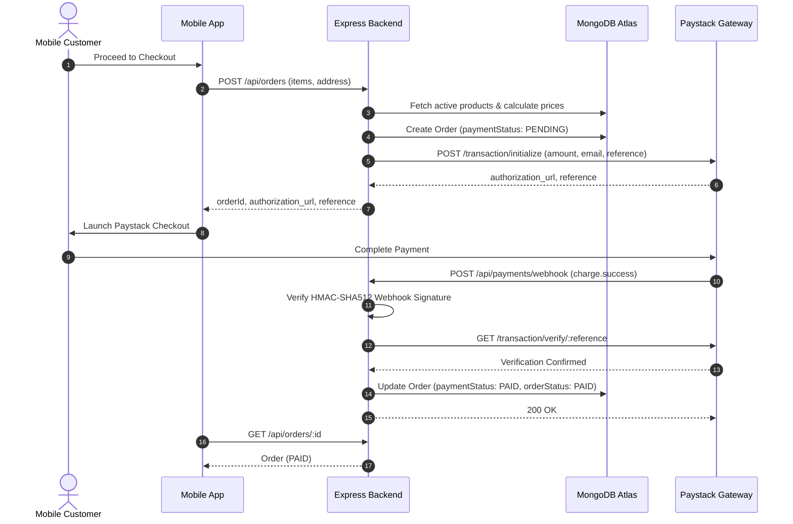

# P2G System Architecture Specification

## 1. Overall System Architecture

P2G is a **single-vendor** commerce and food-ordering platform engineered for a single business merchant. It connects customer ordering via a cross-platform mobile application and operational store management via a web-based admin dashboard, backed by a single centralized REST API.

```text
+-------------------------------------------------------------------------+
|                              CLIENT TIER                                |
|                                                                         |
|   +-------------------------------+   +-----------------------------+   |
|   |     Customer Mobile App       |   |    Admin Web Dashboard      |   |
|   |  (React Native + Expo Router) |   |        (React + Vite)       |   |
|   +---------------+---------------+   +--------------+--------------+   |
+-------------------|----------------------------------|------------------+
                    |                                  |
                    | HTTPS REST API (JSON)            | HTTPS REST API (JSON)
                    v                                  v
+-------------------------------------------------------------------------+
|                              BACKEND TIER                               |
|                                                                         |
|   +-----------------------------------------------------------------+   |
|   |                       Express.js REST API                       |   |
|   |              (Node.js >= 20, Layered Architecture)              |   |
|   +-------------------------------+---------------------------------+   |
+-----------------------------------|-------------------------------------+
                                    |
        +---------------------------+---------------------------+
        |                                                       |
        v                                                       v
+-----------------------+   +-----------------------+   +-----------------------+
|    MongoDB Atlas      |   |       Paystack        |   |      Cloudinary       |
| (Database & Storage)  |   | (Payment Processing)  |   |    (Media Storage)    |
+-----------------------+   +-----------------------+   +-----------------------+
```

### Strict Single-Vendor Boundary
- The platform serves **one merchant/store only**.
- There is **no multi-tenancy**, no `vendorId`, no multi-store routing, no vendor onboarding, and no marketplace commission logic.
- All products, categories, orders, and configuration belong solely to the single merchant operator.

---

## 2. Mobile Architecture

The customer application is built with **React Native** and **Expo** using **Expo Router** for file-based routing.

### Directory Layout
```text
mobile/
├── app/
│   ├── _layout.jsx                   # Root layout (fonts, theme, global providers)
│   ├── (auth)/                       # Public authentication group
│   │   ├── _layout.jsx
│   │   ├── login.jsx                 # Customer login screen
│   │   ├── register.jsx              # Customer registration screen
│   │   └── forgot-password.jsx       # Password recovery screen
│   └── (app)/                        # Authenticated customer group
│       ├── _layout.jsx               # Protected navigation guard
│       ├── (tabs)/                   # Primary bottom tab navigation
│       │   ├── _layout.jsx
│       │   ├── index.jsx             # Home / Catalog browsing
│       │   ├── orders.jsx            # Customer order history
│       │   └── profile.jsx           # Account management & addresses
│       ├── product/
│       │   └── [id].jsx              # Product detail screen
│       ├── cart.jsx                  # Cart review & quantity adjustments
│       ├── checkout.jsx              # Delivery details & Paystack trigger
│       └── order/
│           └── [id].jsx              # Real-time order status tracking
└── src/
    ├── api/
    │   └── client.js                 # Central Axios client with token interceptor
    ├── components/                   # Reusable UI elements (Header, Card, Button, Input)
    ├── hooks/                        # Custom React hooks (useAuth, useCart, useOrders)
    ├── store/
    │   ├── authStore.js              # Zustand store for user session
    │   └── cartStore.js              # Zustand store for cart items (persistent)
    └── utils/                        # Currency formatters, date helpers, constants
```

### Key Architectural Decisions
- **Routing:** Expo Router provides file-based routing; no manual `NavigationContainer` is introduced.
- **Client State:** Zustand manages client-side cart and user session. Cart state persists locally on device.
- **Secure Token Storage:** Auth JWTs are stored securely via `expo-secure-store`.
- **Public Configuration:** Uses `EXPO_PUBLIC_API_URL` and `EXPO_PUBLIC_PAYSTACK_PUBLIC_KEY`. No server-side secrets are bundled.

---

## 3. Backend Architecture

The backend is a **Node.js (>=20)** and **Express.js** REST API designed with a clean, layered structure where routes remain thin, controllers coordinate HTTP input/output, and services encapsulate business logic.

### Directory Layout
```text
backend/
├── src/
│   ├── config/                       # Configuration modules (database, paystack, cloudinary)
│   │   └── database.js               # Mongoose connection & lifecycle singleton
│   ├── controllers/                  # Request/Response handlers
│   │   ├── authController.js         # Register, login, profile, password reset
│   │   ├── categoryController.js     # Public read, admin category CRUD
│   │   ├── productController.js      # Public catalog, admin product CRUD
│   │   ├── orderController.js        # Checkout, customer orders, admin status updates
│   │   ├── paymentController.js      # Paystack initialize, verify, webhook
│   │   └── uploadController.js       # Admin media upload to Cloudinary
│   ├── middleware/                   # Express middleware
│   │   ├── authMiddleware.js         # JWT verification (protect) & role check (authorize)
│   │   ├── errorMiddleware.js        # Centralized error handler & 404 handler
│   │   └── rateLimiters.js           # Global & route-specific rate limiting
│   ├── models/                       # Mongoose schemas & data models
│   │   ├── User.js                   # Customer & Admin accounts
│   │   ├── Category.js               # Product grouping & menu sections
│   │   ├── Product.js                # Menu/Store items with pricing & stock
│   │   └── Order.js                  # Orders with immutable line item snapshots
│   ├── routes/                       # Route definitions
│   │   ├── healthRoutes.js           # GET /api/health
│   │   ├── authRoutes.js             # /api/auth
│   │   ├── categoryRoutes.js         # /api/categories
│   │   ├── productRoutes.js          # /api/products
│   │   ├── orderRoutes.js            # /api/orders
│   │   ├── paymentRoutes.js          # /api/payments
│   │   └── uploadRoutes.js           # /api/uploads
│   ├── services/                     # Business logic & 3rd-party service integrations
│   │   ├── authService.js
│   │   ├── orderService.js           # Authoritative price calculations & order state machine
│   │   ├── paystackService.js        # Paystack API transactions & webhook verification
│   │   ├── cloudinaryService.js      # Media uploads and asset cleanup
│   │   └── emailService.js           # Transactional emails & password recovery
│   ├── utils/                        # Shared utility functions (tokens, formatters, helpers)
│   ├── validators/                   # Zod request validation schemas
│   ├── app.js                        # Express app configuration & middleware pipeline
│   └── server.js                     # Process bootstrap, DB connection, graceful shutdown
├── .env.example
└── package.json
```

---

## 4. Admin Architecture

The admin dashboard is a **React** single-page application built with **Vite** and styled with **Tailwind CSS**. It provides the merchant with complete control over catalog, inventory, orders, and customer activity.

### Directory Layout
```text
admin/
├── src/
│   ├── api/
│   │   └── client.js                 # Axios client with JWT interceptor & error handling
│   ├── components/                   # UI components (Sidebar, Navbar, DataTable, Modal, StatCard)
│   ├── context/                      # AdminAuthContext for session management
│   ├── pages/
│   │   ├── Login.jsx                 # Admin authentication screen
│   │   ├── Dashboard.jsx             # Key metrics (revenue, active orders, popular items)
│   │   ├── Categories.jsx            # Category list & management
│   │   ├── Products.jsx              # Product catalog, stock toggle & management
│   │   ├── ProductForm.jsx           # Create/Edit product with Cloudinary image upload
│   │   ├── Orders.jsx                # Order management with lifecycle status filters
│   │   ├── OrderDetail.jsx           # Detailed order view & fulfillment transitions
│   │   └── Customers.jsx             # Customer overview & order history
│   ├── routes/
│   │   └── AppRoutes.jsx             # React Router routing with admin role guard
│   ├── utils/                        # Formatters, currency helpers, date utilities
│   ├── App.jsx
│   └── main.jsx
├── .env.example
├── index.html
└── package.json
```

### Architectural Principles
- **Protected Routing:** Unauthenticated requests or non-admin users are redirected to `/login`.
- **Zero Direct Cloud/DB Access:** The admin dashboard communicates solely through authenticated endpoints on the Express REST API.

---

## 5. Database Architecture

Data persistence is provided by **MongoDB Atlas** using **Mongoose ODM**.

### Core Collections & Schemas

| Collection | Key Attributes | Responsibility |
|---|---|---|
| **Users** | `name`, `email`, `password` (hashed), `phone`, `role` (`CUSTOMER` \| `ADMIN`), `addresses`, `isActive` | Stores identity and delivery addresses for customers and the single admin. |
| **Categories** | `name`, `slug`, `description`, `image` (`url`, `publicId`), `isActive`, `displayOrder` | Groups products into browsable sections (e.g. Meals, Drinks, Combos). |
| **Products** | `name`, `slug`, `description`, `price`, `comparePrice`, `category` (ref), `images`, `isAvailable`, `stockQuantity`, `preparationTimeMinutes` | Sellable goods with prices, availability flags, and image metadata. |
| **Orders** | `orderNumber`, `customer` (ref), `items` (snapshot array), `subtotal`, `deliveryFee`, `totalAmount`, `deliveryAddress`, `paymentStatus`, `paymentReference`, `orderStatus`, `statusHistory` | Legal record of customer purchase with immutable product snapshots. |

### Immutable Order Item Snapshots
When an order is created, the product's current title, unit price, and image URL are copied directly into the order's `items` array. Subsequent edits or price changes to a product will never alter historical order records.

---

## 6. Authentication

- **Password Security:** Passwords hashed using `bcryptjs` (salt rounds: 10). Password hashes have `select: false` on Mongoose queries and are never returned in responses.
- **Tokens:** Signed JSON Web Tokens (JWT) containing `userId` and `role`. Expiration configured via `JWT_EXPIRES_IN` (default: `7d`).
- **Client Token Handling:**
  - Mobile: Stored securely in hardware-backed keychain via `expo-secure-store`.
  - Admin: Stored securely in memory / local storage with interceptors to handle 401 expiration.
- **Verification:** `protect` middleware extracts bearer token, validates signature, verifies active user in database, and attaches user object to `req.user`.

---

## 7. Authorization

P2G enforces strict **Role-Based Access Control (RBAC)** at the backend middleware layer:

```text
[ Incoming Request ]
         |
         v
+------------------+
|  protect (JWT)   | -----> Extracts & verifies user identity
+--------+---------+
         |
         v
+------------------+
|    authorize     | -----> Compares req.user.role with allowed roles
+--------+---------+
         |
         +---- Role is CUSTOMER? ---> Allowed: Read catalog, manage own cart/profile/orders
         |
         +---- Role is ADMIN?    ---> Allowed: Full catalog, order fulfillment, media, metrics
         |
         +---- Unauthorized?     ---> HTTP 403 Forbidden
```

- Public access is permitted only for `GET /api/health`, active categories, and available products.
- Customers can view and cancel only their own orders (`order.customer.equals(req.user._id)`).

---

## 8. Payment Architecture (Paystack)

Payments are integrated with **Paystack** using a server-authoritative verification flow.



### Security Rules
- **Server Price Authority:** Order totals, subtotal, delivery fees, and taxes are strictly calculated on the backend. Client-submitted prices are ignored.
- **Server Verification Authority:** Client-side "success" redirects never mark an order as paid. Only verified webhook payloads or direct Paystack verification will transition an order to `PAID`.

---

## 9. Cloudinary Architecture

Product and category images are stored in **Cloudinary** via backend-mediated uploads.

- **Private Credentials:** `CLOUDINARY_CLOUD_NAME`, `CLOUDINARY_API_KEY`, and `CLOUDINARY_API_SECRET` remain server-only.
- **Upload Flow:**
  1. Admin selects image in Admin Dashboard.
  2. Admin client posts `multipart/form-data` to backend `/api/uploads`.
  3. Backend validates file type (JPEG, PNG, WebP) and size (max 5MB).
  4. Backend streams image to Cloudinary folder (`p2g/products` or `p2g/categories`).
  5. Cloudinary returns `secure_url` and `public_id`.
  6. Backend returns `{ url, publicId }` to admin for saving with product/category.
- **Asset Cleanup:** When products/categories are deleted or image is replaced, backend calls `cloudinary.uploader.destroy(publicId)` to prevent orphaned assets.

---

## 10. Order Lifecycle

Orders progress through a strictly defined state machine with an audit log (`statusHistory`).

```text
       [ PENDING ] (Order created, awaiting payment)
           |
           +-----------------------------+
           | (Payment Verified)          | (Customer cancels before payment)
           v                             v
       [  PAID   ]                 [ CANCELLED ]
           |
           | (Admin confirms & starts prep)
           v
      [ PREPARING ]
           |
           | (Kitchen/Store finishes prep)
           v
       [  READY  ]
           |
           | (Dispatched with delivery courier)
           v
   [ OUT_FOR_DELIVERY ]
           |
           | (Courier hands over to customer)
           v
      [ DELIVERED ]
```

### Status Definitions
- **Payment Statuses:** `PENDING`, `PAID`, `FAILED`, `REFUNDED`.
- **Order Fulfillment Statuses:**
  - `PENDING`: Order created; awaiting Paystack confirmation.
  - `PAID`: Payment verified; queued for store action.
  - `PREPARING`: Store kitchen/staff is assembling the order.
  - `READY`: Order packaged and waiting for dispatch or pickup.
  - `OUT_FOR_DELIVERY`: Courier is en route to customer delivery address.
  - `DELIVERED`: Order completed and received.
  - `CANCELLED`: Order terminated; reason logged in history.

---

## 11. API Architecture

All endpoints use JSON over HTTPS and are namespaced under `/api`.

### Standard Response Envelope
```json
{
  "success": true,
  "message": "Optional human-readable message",
  "data": { ... },
  "pagination": {
    "page": 1,
    "limit": 20,
    "total": 50,
    "pages": 3
  }
}
```

### Standard Error Envelope
```json
{
  "success": false,
  "message": "Error description",
  "errors": [
    { "field": "email", "message": "Invalid email address format" }
  ]
}
```

### Endpoint Registry

| Domain | Method & Route | Access | Purpose |
|---|---|---|---|
| **Health** | `GET /api/health` | Public | Verify server uptime & status |
| **Auth** | `POST /api/auth/register` | Public | Register customer account |
| | `POST /api/auth/login` | Public | Authenticate customer or admin |
| | `GET /api/auth/me` | Protected | Get authenticated profile |
| | `PUT /api/auth/profile` | Protected | Update profile & address |
| **Categories** | `GET /api/categories` | Public | List active categories |
| | `POST /api/categories` | Admin | Create category |
| | `PUT /api/categories/:id` | Admin | Update category |
| | `DELETE /api/categories/:id` | Admin | Delete category |
| **Products** | `GET /api/products` | Public | List available products (search, filter, page) |
| | `GET /api/products/:id` | Public | Get product details |
| | `POST /api/products` | Admin | Create product |
| | `PUT /api/products/:id` | Admin | Update product |
| | `DELETE /api/products/:id` | Admin | Delete product |
| **Orders** | `POST /api/orders` | Customer | Create order & calculate totals |
| | `GET /api/orders/my-orders` | Customer | View customer order history |
| | `GET /api/orders/:id` | Protected | View single order detail |
| | `PUT /api/orders/:id/cancel` | Customer | Cancel pending order |
| | `GET /api/orders` | Admin | View all store orders with filters |
| | `PUT /api/orders/:id/status` | Admin | Update fulfillment lifecycle status |
| **Payments** | `POST /api/payments/initialize` | Customer | Initialize Paystack transaction |
| | `GET /api/payments/verify/:ref` | Protected | Verify payment status |
| | `POST /api/payments/webhook` | Paystack | Webhook for payment events |
| **Uploads** | `POST /api/uploads` | Admin | Upload media to Cloudinary |

---

## 12. Security Architecture

- **HTTP Security Headers:** Implemented via `helmet` (clickjacking, XSS, content-type sniffing protection).
- **CORS Allowlist:** Origin restricted to `CLIENT_URL` and `ADMIN_URL` for web requests; allows native mobile non-origin calls.
- **Rate Limiting:**
  - Global: 300 requests per 15 minutes.
  - Authentication routes: Strict rate limiter (10 requests per 15 minutes) to defeat brute-force credential stuffing.
- **Input Validation & Sanitization:** Zod schemas validate every incoming request body, query parameter, and route parameter.
- **Tamper-Proof Pricing:** Client-provided prices are never used in order calculations.
- **Webhook Integrity:** Paystack webhook HMAC-SHA512 signatures validated with `PAYSTACK_WEBHOOK_SECRET` before processing.
- **Environment Isolation:** Secrets exist solely in uncommitted `.env` files.

---

## 13. Environment Strategy

| Application | Environment File | Variables Defined |
|---|---|---|
| **Backend** | `backend/.env` | `NODE_ENV`, `PORT`, `APP_NAME`, `MONGODB_URI`, `JWT_SECRET`, `JWT_EXPIRES_IN`, `PAYSTACK_SECRET_KEY`, `PAYSTACK_PUBLIC_KEY`, `PAYSTACK_CALLBACK_URL`, `PAYSTACK_WEBHOOK_SECRET`, `CLOUDINARY_CLOUD_NAME`, `CLOUDINARY_API_KEY`, `CLOUDINARY_API_SECRET`, `CLIENT_URL`, `ADMIN_URL`, `EMAIL_*`, `PASSWORD_RESET_URL` |
| **Mobile** | `mobile/.env` | `EXPO_PUBLIC_API_URL`, `EXPO_PUBLIC_PAYSTACK_PUBLIC_KEY` |
| **Admin** | `admin/.env` | `VITE_API_URL` |

- `.env.example` files contain only key names and placeholders and remain safely tracked in source control.
- Production `.env` files are never committed.

---

## 14. Development Workflow

```text
Phase 1: Architecture & Foundation (Current)
    ├── Establish system design, environment templates, docs
    └── Verify Express 5 server & database connection modules

Phase 2: Backend Core Business Domains
    ├── 2.1 User Model, JWT Authentication & RBAC Middleware
    ├── 2.2 Category & Product Models, Validators & Catalog Endpoints
    ├── 2.3 Cloudinary Media Upload Service
    ├── 2.4 Server-Priced Order Engine & Status State Machine
    └── 2.5 Paystack Checkout Initialization & Webhook Verification

Phase 3: Customer Mobile App (Expo & Expo Router)
    ├── 3.1 Expo setup with Expo Router & Axios client
    ├── 3.2 Authentication screens & secure token persistence
    ├── 3.3 Product catalog, category filtering, product detail
    ├── 3.4 Zustand persistent Cart
    └── 3.5 Checkout screen, Paystack payment launch, order tracking

Phase 4: Admin Web Dashboard (React & Vite)
    ├── 4.1 Vite + React SPA setup with Tailwind CSS
    ├── 4.2 Protected Admin routing & login
    ├── 4.3 Category & Product CRUD with Cloudinary image uploader
    └── 4.4 Real-time order fulfillment status management

Phase 5: Quality Assurance & Deployment Hardening
    ├── Integration testing, security audit, edge case validation
    └── Cloud hosting deployment (Render/Railway, Atlas, Vercel, EAS)
```

---

## 15. Testing Strategy

1. **Backend Integration Tests:**
   - Supertest for REST endpoint integration testing.
   - Authentication negative tests (expired tokens, tampered signatures, unauthorized role access).
   - Order calculation verification (ensuring discounts, tax, and quantities total accurately).
   - Paystack webhook signature verification tests.
2. **Client Verification:**
   - Mobile: User flow testing (Register -> Browse -> Add to Cart -> Checkout -> Payment -> Order Status).
   - Admin: Operational flow testing (Add Product with Image -> Adjust Price -> Receive Order -> Progress Status).
3. **Resilience & Edge Cases:**
   - Out-of-stock item handling during checkout.
   - Idempotent payment webhook processing (handling duplicate webhook deliveries safely).

---

## 16. Deployment Strategy

```text
+-------------------+      +-------------------+      +-------------------+
|  Mobile (Expo)    |      | Admin (Vercel)    |      | Backend (Render)  |
|  - EAS Build      |      | - Vite React SPA  |      | - Express REST    |
|  - Android APK/AAB|      | - Static CDN Host |      | - Node.js Runtime |
|  - iOS IPA        |      | - VITE_API_URL    |      | - Auto Deploy     |
+-------------------+      +-------------------+      +---------+---------+
                                                                |
                                             +------------------+------------------+
                                             |                                     |
                                             v                                     v
                                   +-------------------+                 +-------------------+
                                   |   MongoDB Atlas   |                 | Cloudinary /      |
                                   |   - M0 / Shared   |                 | Paystack Cloud    |
                                   |   - IP Whitelist  |                 | - Managed SaaS    |
                                   +-------------------+                 +-------------------+
```

- **Backend:** Deployed on Render or Railway with production environment variables set via dashboard.
- **Database:** MongoDB Atlas cluster with restricted network IP allowlist and automated backups.
- **Admin Dashboard:** Static SPA hosted on Vercel or Netlify with public `VITE_API_URL` injected at build time.
- **Mobile Application:** Packaged using Expo Application Services (EAS Build) for Google Play and Apple App Store distribution.
